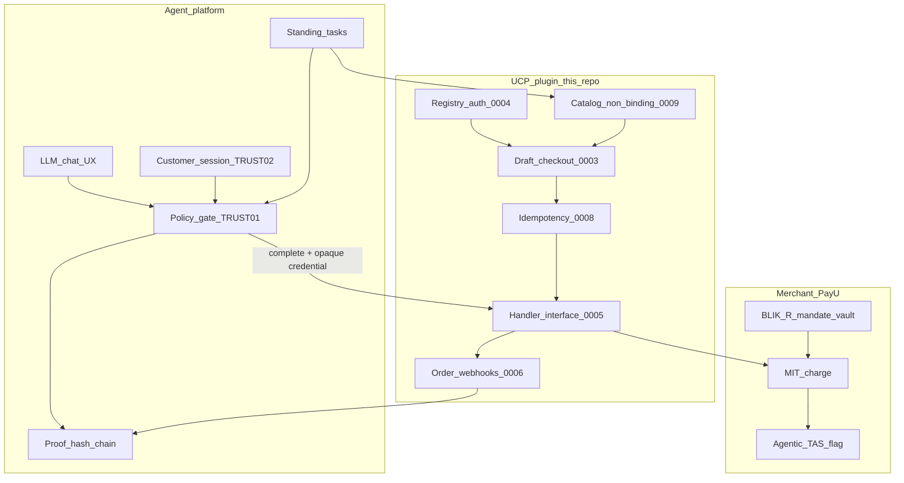

# Architecture Decision Records

Draft ADRs for **UCP Server for WooCommerce**. They propose **why** the implementation
(and POC posture) should look a certain way. **Nothing here is decided yet** — status of
every ADR is **Proposed (needs team review)**.

Requirements stay in [requirements.md](../requirements.md); how-tos in
[payment-handlers.md](../payment-handlers.md) and
[agent-integration-notes.md](../agent-integration-notes.md).

Cross-repo drafts: sibling `agentic-commerce-agent` (`docs/adr/`,
`docs/ucp-integration-sequence.md`) and `agentic-commerce-merchant/docs/adr/` — also
**Proposed** until team review.

## Responsibility split (draft — for team discussion)



| Question (Teams) | Proposed answer (not ratified) |
| --- | --- |
| How does the guardrail look? | **Two layers.** Shop: registry key↔profile, opaque credentials, idempotent complete, signed order webhooks, fail-closed (ADR-UCP-0004/0005/0006/0007/0008). Platform: deterministic policy gate before every charge (agent TRUST-01). LLM cannot pay alone. |
| Generic for several merchants? | Protocol identity is generic. **POC draft:** one controlled merchant — no Empik/Morele aggregator in this phase. |
| Do we verify merchants? | **POC draft:** allow-list one platform on our merchant (`auth_mode=registry`). No public merchant KYC in this plugin. |

## Index

| ID | Title | Status | Date |
| --- | --- | --- | --- |
| [UCP-0001](UCP-0001-pin-ucp-release-and-conformance-authority.md) | Pin UCP 2026-04-08 and conformance as authority | Proposed (needs team review) | 2026-08-13 |
| [UCP-0002](UCP-0002-dual-transport-shared-services.md) | Dual transport (REST primary, MCP secondary) | Proposed (needs team review) | 2026-08-13 |
| [UCP-0003](UCP-0003-draft-order-backed-checkout.md) | Draft-order checkout; POC cart vs CART-03 | Proposed (needs team review) | 2026-08-13 |
| [UCP-0004](UCP-0004-registry-auth-and-profile-bound-keys.md) | Registry auth and profile-bound API keys | Proposed (needs team review) | 2026-08-13 |
| [UCP-0005](UCP-0005-pluggable-payment-handlers.md) | Pluggable handlers and opaque credentials | Proposed (needs team review) | 2026-08-13 |
| [UCP-0006](UCP-0006-signed-webhooks-rfc9421.md) | Signed order webhooks (RFC 9421 ES256) | Proposed (needs team review) | 2026-08-13 |
| [UCP-0007](UCP-0007-config-fail-closed-gated-test-surfaces.md) | Config precedence, fail-closed, gated tests | Proposed (needs team review) | 2026-08-13 |
| [UCP-0008](UCP-0008-idempotency-for-checkout-mutations.md) | Idempotency for checkout mutations | Proposed (needs team review) | 2026-08-13 |
| [UCP-0009](UCP-0009-catalog-vs-checkout-and-change-signals.md) | Catalog vs checkout; order vs catalog signals | Proposed (needs team review) | 2026-08-13 |
| [UCP-0010](UCP-0010-buyer-identity-on-checkout.md) | Buyer identity (no WC login binding) | Proposed (needs team review) | 2026-08-13 |

### Known POC gaps (proposed — not decided)

| Gap | Tracking |
| --- | --- |
| CART-03 shared storefront↔chat cart | ADR-UCP-0003 — proposed POC gap |
| REST idempotency optional if header absent | ADR-UCP-0008 — agent would always send keys |
| WC `customer_id` linkage | ADR-UCP-0010 — platform session; future bridge |
| PayU BLIK-R handler / agentic TAS flag | Merchant + PayU — not this public repo |
| Catalog push webhooks | ADR-UCP-0009 — poll / merchant Demo Control |

## Naming

ADR ids are **repo-scoped** so they never collide across the POC:

| Prefix | Repository |
| --- | --- |
| `ADR-UCP-NNNN` / file `UCP-NNNN-…` | `ucp-server-for-woocommerce` |
| `ADR-AGT-NNNN` / file `AGT-NNNN-…` | `agentic-commerce-agent` |
| `ADR-MER-NNNN` / file `MER-NNNN-…` | `agentic-commerce-merchant` |

Always use the full id in cross-repo links (e.g. `ADR-AGT-0002`, not `ADR-0002`).

## Format

```markdown
# ADR-UCP-NNNN: Title

- Status: Proposed (needs team review) | Accepted | Deprecated | Superseded by ADR-UCP-XXXX
- Date: YYYY-MM-DD
- Deciders: …

## Context
## Decision
## Consequences
## Alternatives considered
## Security notes   # omit when not applicable
## Related
```

Numbering is zero-padded to four digits within the prefix. Prefer links to `src/…` and how-to docs over copying them.
